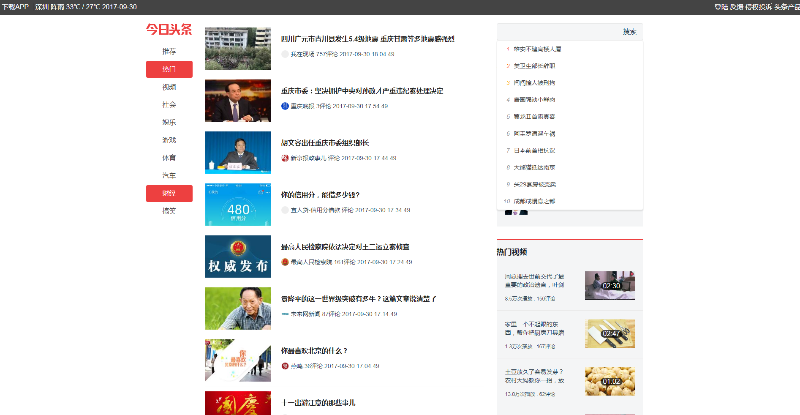

# vuetest

> 基于vue2.0+vue-router+axios仿今日头条Pc端
>> 使用node服务代理，去请求今日头条的数据
>> 只是取了首屏数据
# 重点
>怎么使用node服务代理去请求数据



## Build Setup

``` bash
# install dependencies
npm install

# serve with hot reload at localhost:8080
npm run dev

# build for production with minification
npm run build


欢迎一起学习交流（ethans.song.net@gmail.com）